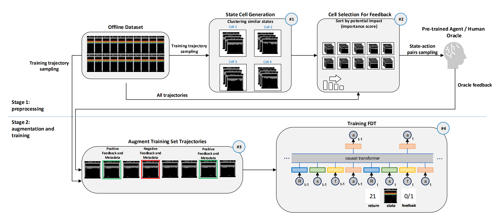

# Feedback-Decision-Transformer

Author: Liad Giladi.

This project was carried out as part of my master's thesis, supervised by Dr. Gilad Katz.

A link to our paper can be found on [arXiv](TODO).

## Overview

The official codebase for [Feedback Decision Transformer: Offline Reinforcement Learning With Feedback](https://github.com/liadgiladi/feedback-decision-transformer).

TL;DR: We propose Feedback Decision Transformer (FDT), a data-driven approach that uses limited amounts of high-quality feedback at critical states to significantly improve DT’s performance.



## Installation

### Install Dependencies
You can install the required dependencies by running the following commands:

```shell
poetry install
poe force-torch-cuda11
poe force-jaxlib-cuda11
poetry run python -m atari_py.import_roms Roms/
```
### Downloading Datasets

Create a directory for the dataset and load the dataset using [gsutil](https://cloud.google.com/storage/docs/gsutil_install#install). Replace `[DQN_REPLAY_DIRECTORY_NAME]` and `[GAME_NAME]` accordingly (e.g., `./dqn_replay` for `[DQN_REPLAY_DIRECTORY_NAME]` and `Breakout` for `[GAME_NAME]`)
```
mkdir [DQN_REPLAY_DIRECTORY_NAME]
gsutil -m cp -R gs://atari-replay-datasets/dqn/[GAME_NAME] [DQN_REPLAY_DIRECTORY_NAME]
```

## Run Training 

### FDT
```
for seed in 123 231 312 0 42 84 64 128 256 512
do
	python run.py --gpus 1 --lr 6e-4 --states_for_feedbacks_based_on_important_states [IMPORTANT_STATES_FILE_NAME] --num_of_important_states [FEEDBACK_NUM] --feedback_regularization_lambda [FEEDBACK_LAMBDA] --wandb_project_name [WANDB_PROJECT_NAME] --conditioned_rtg [CONDITIONED_RTG] --seed $seed --generate_dataset_seed $seed --augment_only_sparse_reward_with_synthetic_oracle_feedback --disable_training_game_evaluation_callback --epochs 5 --game [GAME] --data_dir_prefix [DQN_REPLAY_DIRECTORY_NAME]
done
```
**Remark**: for Pong set the following flags to control the batch-size and context-length:
```
--batch_size 256 --context_length 50
```
===============

### DT
```
for seed in 123 231 312 0 42 84 64 128 256 512
do
	python run.py --gpus 1 --lr 6e-4 --wandb_project_name [WANDB_PROJECT_NAME] --conditioned_rtg [CONDITIONED_RTG] --seed $seed --generate_dataset_seed $seed --augment_only_sparse_reward_with_synthetic_oracle_feedback --disable_training_game_evaluation_callback --epochs 5 --game [GAME] --data_dir_prefix [DQN_REPLAY_DIRECTORY_NAME]
done
```
**Remark**: for Pong set the following flags to control the batch-size and context-length:
```
--batch_size 256 --context_length 50
```
===============

### BC
```
for seed in 123 231 312 0 42 84 64 128 256 512
do
	python run.py --model_type naive --gpus 1 --lr 6e-4 --wandb_project_name [WANDB_PROJECT_NAME] --conditioned_rtg [CONDITIONED_RTG] --seed $seed --generate_dataset_seed $seed --augment_only_sparse_reward_with_synthetic_oracle_feedback --disable_training_game_evaluation_callback --epochs 5 --game [GAME] --data_dir_prefix [DQN_REPLAY_DIRECTORY_NAME]
done
```
**Remark**: for Pong set the following flags to control the batch-size and context-length:
```
--batch_size 256 --context_length 50
```

## Run Evaluation
### FDT
```
for seed in 123 231 312 0 42 84 64 128 256 512
do
	python run.py --gpus 1 --eval_model --wandb_project_name_for_loading_pretrained_model [WANDB_PRETRAINED_MODEL_PROJECT_NAME] --test_seeds '[123, 231, 312, 0, 42, 84, 64, 128, 256, 512]' --lr 6e-4 --states_for_feedbacks_based_on_important_states [IMPORTANT_STATES_FILE_NAME] --num_of_important_states [FEEDBACK_NUM] --feedback_regularization_lambda [FEEDBACK_LAMBDA] --wandb_project_name [WANDB_PROJECT_NAME] --conditioned_rtg [CONDITIONED_RTG] --seed $seed --generate_dataset_seed $seed --augment_only_sparse_reward_with_synthetic_oracle_feedback --disable_training_game_evaluation_callback --epochs [EPOCH] --game [GAME] --batch_size 128 --context_length 30 --data_dir_prefix [DQN_REPLAY_DIRECTORY_NAME]
done
```
**Remark**: for Pong set the following flags to control the batch-size and context-length:
```
--batch_size 256 --context_length 50
```

**Remark**: in the case of Seaquest, due to inconsistencies and a bug in the Atari environment package, please run it with seed 1028 instead of seed 0. Consequently, replace the following flag:
```
--test_seeds '[123, 231, 312, 1024, 42, 84, 64, 128, 256, 512]'
```
===============

### DT
```
for seed in 123 231 312 0 42 84 64 128 256 512
do
	python run.py --gpus 1 --eval_model --test_seeds '[123, 231, 312, 0, 42, 84, 64, 128, 256, 512]' --lr 6e-4 --wandb_project_name [WANDB_PROJECT_NAME] --conditioned_rtg [CONDITIONED_RTG] --seed $seed --generate_dataset_seed $seed --augment_only_sparse_reward_with_synthetic_oracle_feedback --disable_training_game_evaluation_callback --epochs [EPOCH] --game [GAME] --batch_size 128 --context_length 30 --data_dir_prefix [DQN_REPLAY_DIRECTORY_NAME]
done
```
**Remark**: for Pong set the following flags to control the batch-size and context-length:
```
--batch_size 256 --context_length 50
```

**Remark**: in the case of Seaquest, due to inconsistencies and a bug in the Atari environment package, please run it with seed 1028 instead of seed 0. Consequently, replace the following flag:
```
--test_seeds '[123, 231, 312, 1024, 42, 84, 64, 128, 256, 512]'
```
===============

### BC
```
for seed in 123 231 312 0 42 84 64 128 256 512
do
	python run.py --model_type naive --gpus 1 --eval_model --test_seeds '[123, 231, 312, 0, 42, 84, 64, 128, 256, 512]' --lr 6e-4 --wandb_project_name [WANDB_PROJECT_NAME] --conditioned_rtg [CONDITIONED_RTG] --seed $seed --generate_dataset_seed $seed --augment_only_sparse_reward_with_synthetic_oracle_feedback --disable_training_game_evaluation_callback --epochs [EPOCH] --game [GAME] --batch_size 128 --context_length 30 --data_dir_prefix [DQN_REPLAY_DIRECTORY_NAME]
done
```
**Remark**: for Pong set the following flags to control the batch-size and context-length:
```
--batch_size 256 --context_length 50
```

**Remark**: in the case of Seaquest, due to inconsistencies and a bug in the Atari environment package, please run it with seed 1028 instead of seed 0. Consequently, replace the following flag:
```
--test_seeds '[123, 231, 312, 1024, 42, 84, 64, 128, 256, 512]'
```

## Generate Important States For Feedback

To generate important states for feedback, run the following:

```bash
for seed in 123 231 312 0 42 84 64 128 256 512
do
	python generate_important_states.py --seed $seed --generate_dataset_seed $seed --augment_only_sparse_reward_with_synthetic_oracle_feedback --num_frames 4 --num_steps 50000000 --num_buffers 50 --game [GAME] --context_length [CONTEXT_LENGTH] --data_dir_prefix [DQN_REPLAY_DIRECTORY_NAME] --notify_important_states_with_multiple_occurrences_n [CELL_SAMPLING_STRATEGY] --minimum_num_state_rtgs_to_consider_for_important_state [MINIMUM_REQUIRED_RTG] --gamma [GAMMA] --life_loss_negative_reward [LIFE_LOSS_NEGATIVE_REWARD] --steps_ahead_for_terminal_or_life_loss_state [WINDOW_STEPS_AHEAD_FOR_LIFE_LOSS]
done
````

Upon execution, a set of 2 files will be generated for each seed, following this pattern:

```
500000_{game}_{seed}_{gamma}_{kernel_size}-{stride}_{num_steps}_{num_frames}_{minimum_num_state_rtgs_to_consider_for_important_state}_{window_size_for_important_state}_multiple_occurrences_{notify_important_states_with_multiple_occurrences_n}_first_visit_{first_visit_state_action}_important_states_indices_with_life_loss_{steps_ahead_for_terminal_or_life_loss_state}_{life_loss_negative_reward}
```

Among these files, one carries a .npz extension and the other a .txt extension. The former file encompasses states from the chosen game, while the latter holds the subsequent metadata:

```
X transitions total divided into X trajectories
total num of states allowed for feedback is X
num of states allowed for feedback is X
num_states_that_sometimes_not_valid_but_already_candidates X
num_states_that_are_skipped X
num of valid states is X
num_of_state_ignored_due_to_small_rtg_samples X
num_of_states_with_more_than_2_actions_before_removing_actions X
num of valid states with more than 2 actions is X
important states num: X
important states indices: X
job-id: X
start time X
end time X
```

### Viewing States
To observe metadata and significant states, initiate the following command:

```bash
python generate_important_states.py --export_important_states_as_images --seed [SEED] --generate_dataset_seed [SEED] --augment_only_sparse_reward_with_synthetic_oracle_feedback --num_frames 4 --num_steps 50000000 --num_buffers 50 --game [GAME] --context_length [CONTEXT_LENGTH] --data_dir_prefix [DQN_REPLAY_DIRECTORY_NAME] --notify_important_states_with_multiple_occurrences_n [CELL_SAMPLING_STRATEGY] --minimum_num_state_rtgs_to_consider_for_important_state [MINIMUM_REQUIRED_RTG] --gamma [GAMMA] --life_loss_negative_reward [LIFE_LOSS_NEGATIVE_REWARD] --steps_ahead_for_terminal_or_life_loss_state [WINDOW_STEPS_AHEAD_FOR_LIFE_LOSS]
````

Executing this will generate a folder structured in the previously mentioned file format, containing the significant states of the selected game.
Note: require the relevant generated *.npz file.

## Oracle Feedback Generation

To generate oracle feedback, follow these steps:

1. Download the [C51 checkpoints](https://github.com/google/dopamine/tree/master/docs#downloads) and save them in the directory in the following format: './synthetic_oracle/checkpoints/{agent_name}/{game}/'.

2. Run the provided script using the following command, specifying the game and pretrained agent name. This will result in the creation of a directory named 'dqn_feedback' containing the relevant Oracle feedback output.

### Execution:
```bash
python augment_dataset_with_oracle_feedback_dopamine.py --game [GAME] --agent_name 'c51'
```

### Augmented DQN Replay Dataset with Oracle Feedback
Our augmented DQN Replay Dataset with Oracle feedback can be found under the directory: 'feedback_augmented_dqn_replay_dataset'

## Detailed Results + Experimental Details
You can access all the hyperparameters and logs for our experimental runs in our TODO project. 

Additionally, for more comprehensive information regarding the experiment configurations, including hyperparameters, setup, dataset details, and more detailed results, please consult the accompanying appendix PDF file.

## Citation

To cite FDT, you can use the following BibTeX entry:

```bibtex
TODO
```

## License

This project is licensed under the MIT License.


## Acknowledgments
Our code is based on the implementation of [Decision Transformer](https://github.com/scottemmons/decision-transformer). 
